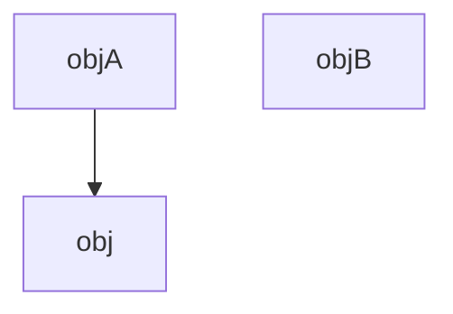

Проблема при разработке ПО - добавление какого-либо функционала.

Пусть у нас есть следующее:



>Мы хотим расширить, добавить что-то в объект A и B (причем это одно и то же). Идея такая: сделать производный класс от ObjectA и ObjectB, добавляя _вот это новое_, причем не расширяя интерфейс, а подменяя его.
### Что сразу бросается в глаза, когда мы добавляем _одно и то же_

1. У нас будет повторяющийся код. Мы должны с этим бороться .
2. Это приводит к резкому разрастанию всей иерархии наследования. Могут быть другие добавления, а к ним еще.
### Идея

_Вот это добавление_ вынести в отдельный класс - класс-декоратор.

![[dec.png]]

>Есть класс Component. От него производные классы - какие-то конкретные компоненты: ComponentA и ComponentB. Мы создаем класс Decorator, который обладает таким же интерфейсом, но, кроме всего прочего, он имеет ссылку на базовый класс Component. От него мы уже можем порождать конкретные декораторы - Decorator1 и Decorator 2. Decorator имеет ссылку на компонент, и вызывая метод компонента, на который держится ссылка, добавляет свой функционал. Таким образом, мы можем добавить к любому компоненту единый функционал.

Таким образом, мы можем отдекорировать сам декоратор...

***

**Преимущества:**
- Во время выполнения программы можно изменить сущность, то есть ее продекодировать, меняя ее поведение.
- Нет разрастания иерархии
- Нет дублирования кода

**Недостатки:**
- Работа с декоратором может долго, полиморфно делать цепочку вызовов, следовательно долгая работа программы.
- Никто не отвечает за оборачивание декоратора: за порядок их вызова и оборачивание. Вся ответственность не программисте.
- Если в цепочке декораторов необходимо что-то изменить или удалить какую-то обертку, придется заново оборачивать.

```c++
# include <iostream>
# include <memory>

using namespace std;

class Component
{
public:
	virtual ~Component() = default;

	virtual void operation() = 0;
};

class ConComponent : public Component
{
public:
	void operation() override { cout << "ConComponent; "; }
};

class Decorator : public Component
{
protected:
	shared_ptr<Component> component;

public:
	Decorator(shared_ptr<Component> comp) : component(comp) {}
};

class ConDecorator : public Decorator
{
public:
	using Decorator::Decorator;

	void operation() override;
};

# pragma region Method
void ConDecorator::operation()
{
	if (component)
	{
		component->operation();

		cout << "ConDecorator; ";
	}
}

# pragma endregion

int main()
{
	shared_ptr<Component> component = make_shared<ConComponent>();
	shared_ptr<Component> decorator1 = make_shared<ConDecorator>(component);
	
	decorator1->operation();
	cout << endl;
	
	shared_ptr<Component> decorator2 = make_shared<ConDecorator>(decorator1);
	
	decorator2->operation();
	cout << endl;
}
```