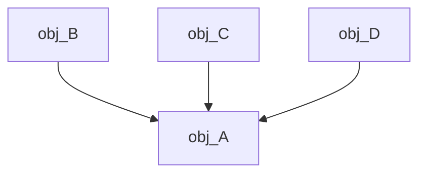

>Существует проблема. Предположим, у нас есть класс А, в котором есть метод f(). Мы не знаем, что творится внутри f(), и, естественно, мы используем механизм обработки исключительных ситуаций. Внутри f() происходит исключительная ситуация, она приводит к тому, что мы перескакиваем на какой-то обработчик, неизвестно где находящийся. Это приводит к тому, что объект p не удаляется - происходит утечка памяти.

```c++
A* p = new A;  
p->f(); // Внутри f() происходит исключительная ситуация 
delete p; // Объект p не удаляется
```

>Идея: обернуть объект в оболочку, которая статическая распределяет память. Эта оболочка будет отвечать за этот указатель. И соответственно, поскольку мы статически распределили, когда будет вызываться деструктор, в деструкторе мы будем освобождать память.

>Шаблон Holder. Мы можем указатель p обернуть в объект-хранитель. Этот объект будет содержать указатель на объект A. Задача объекта: при выходе из области видимости объекта-хранителя будет вызываться деструктор obj, в котором мы можем уничтожить объект A.

```c++
Holder<A> obj(new A);
```

>Для объекта хранителя достаточно определить три операции - * (получить значение по указателю), ->(обратиться к методу объекта, на который указывает указатель) и bool(проверить, указатель указывает на объект, nullptr он или нет). Чтобы можно было записать obj->f();. То есть эта оболочка должна быть "прозрачной". Её задача должна быть только вовремя освободить память, выделенную под объект. Мы работаем с объектом класса А через эту оболочку.

```c++
# include <iostream>

using namespace std;

template <typename Type>
class Holder
{
private:
    Type* ptr{ nullptr };

public:
    Holder() = default;
    explicit Holder(Type* p) : ptr(p) {}
    Holder(Holder&& other) noexcept
    {
        ptr = other.ptr;
        other.ptr = nullptr;
    }
    ~Holder() { delete ptr; }

    Type* operator ->() noexcept { return ptr; }
    Type& operator *() noexcept { return *ptr; }
    operator bool() noexcept { return ptr != nullptr; }

    Type* release() noexcept
    {
        Type* work = ptr;
        ptr = nullptr;

        return work;
    }

    Holder(const Holder&) = delete;
    Holder& operator =(const Holder&) = delete;
};

class A
{
public:
    void f() { cout << "Function f of class A is called" << endl; }
};

int main()
{
    Holder<A> obj(new A{});

    obj->f();
}

```

>Например, мы получили указатель p. Этот объект может быть удалён, и в этом случае возникает проблема: указатель, инициализированный каким-то адресом, будет указывать на удалённый объект. Можно рассматривать каждый объект, который держит указатель, как хранитель. То есть мы отдаём указатель на объект, а объект-хранитель считает, что этот объект его собственный, происходит захват.

>В случае если хранитель отдаёт объект, нужно позаботиться о том, чтобы не образовался "висящий" указатель, то есть указатель на объект, которого нет.

>Проблема с утечкой памяти не такая острая как проблема с висящим указателем. Утечка памяти приводит всего лишь к нехватке памяти, в то время как с висящим указателем мы можем случайно вызвать метод несуществующего объекта, что приведёт к падению системы.

>Представим, что на один объект держат указатели несколько объектов. Как понять, какой из объектов должен удалять этот указатель? Если это отдавать на откуп программиста, то о надежности такого кода говорить нельзя, возможно ошибка. Допустим, мы выбрали один из объектов ответственным. Какая гарантия, что он не уничтожится раньше, чем другие два объекта?


>Идея: последний, кто уезжает, выключает свет. То есть последний объект (класса B), который будет уничтожаться, он должен позаботиться об объекте класса A.

>Умные указатели решают проблемы с утечкой памяти и с висящим указателем. Первоначально эту проблему пытались решить одним указателем, но скоро поняли, что одним указателем решить проблему невозможно.

Существует три вида умных указателей, каждый решает свою проблемы.

## unique_ptr

Пример с Holder (ранее), по существу, представляет собой указатель unique_ptr. Жестко сберегает какой-то один объекта. Он хранит уникальную ссылку на объект и не позволяет другим указателям владеть этим объектом.

**Применение unique_ptr:**
```c++
# include <iostream>
# include <memory>

using namespace std;

class A
{
public:
    A() { cout << "Constructor" << endl; }
    ~A() { cout << "Destructor" << endl; }

    void f() { cout << "Function f" << endl; }
};

int main()
{
    unique_ptr<A> obj1(new A{});
    unique_ptr<A> obj2 = make_unique<A>();
    unique_ptr<A> obj3(obj1.release()); // move(obj1)

    obj1 = move(obj3);

    if (!obj3)
    {
        A* p = obj1.release();

        obj2.reset(p);
        obj2->f();
    }
}

```

## shared_ptr и weak_ptr

>Если shared_ptr обеспечивает нас счетчиком, это так называемое совместное владение, то в паре с ним идет weak_ptr - слабое владение. Этот указатель не отвечает за освобождение памяти из-под объекта. Он может только проверить, есть объект или его нет. Эти два указателя связаны между собой.

>У нас должен быть счетчик countS, определяющий, сколько объектов указывают на сберегаемый объект. Указателю weak_ptr тоже надо знать об этом счетчике.

>Пусть есть какой-то базовый класс, от которого порождаем два класса: shared_ptr и weak_ptr. И тому и другому нужен указатель на object и нужен счетчик countS. Базовый класс содержит указатель на объект, и счетчик countS тоже должен быть доступен всем shared_ptr и weak_ptr, следовательно, счетчик countS мы тоже должны вынести, как объект.

>Так как память object вынесли, по счетчику countS weak_ptr определяет, есть ли этот object или нет. Если счетчик равен нулю, то объекта нет. Когда создается новый shared_ptr на область памяти object, счетчик countS увеличивается. Удаляется shared_ptr - счетчик уменьшается. Если счетчик равен нулю - эта память должна быть освобождена.

>А что будет отвечать за память счетчика countS, когда освободится память из-под object? Здесь встает необходимость считать не только количество объектов shared_ptr, но и количество объектов weak_ptr. То есть, по существу, у нас не один счетчик, а два. Счетчик weak_ptr нужен для того, что, если он станет равен нулю, и второй счетчик равен нулю, освободить эту память. Соответственно, общий класс для shared_ptr и weak_ptr может решать эту проблему. Он будет контролировать и память объектов, и область счетчика.

![[pointer.png]]

>В общем, суть в том, что мы не можем удалить счетчик _countS_, так как он нужен `weak_ptr`, чтобы понять, есть объект, или нет.

>Мы можем удалить счетчик только в том случае, когда количество `weak_ptr`  + количество `shared_ptr` будет равняться 0.

#### Подробнее про умные указатели:
**Подробнее про `unique_ptr`.** Мы можем работать не с одним объектом, а с несколькими объектами - оператор `[]`. Есть проблема - мы не знаем, сколько объектов хранит `unique_ptr`, и с помощью `unique_ptr` мы это определить не можем. Должно быть данное, которое (если `unique_ptr` хранит, например, массив объектов) мы должны тащить вместе с `unique_ptr`. Проблема. Решение - можно сделать еще одну обертку, передавая `unique_ptr` и количество элементов.

**Подробнее про `shared_ptr`**. Появляются методы, связанные с совместным владением:

- нам нужно знать количество указателей `shared_ptr` на объект - метод `use_count`.
- метод, который говорит, один `shared_ptr` или нет - `unique`, возвращающий `true`, если всего один `shared_ptr` и `false` в противном случае.

**Подробнее про `weak_ptr`**. Здесь реализован такой механизм... `weak_ptr` - слабое владение. Если мы начнем через него работать с объектом, то возможно, что объект будет удален во время работы, а нам бы этого не хотелось. Поэтому было принято решение, что на основе `weak_ptr` будет создаваться `shared_ptr`, который будет захватывать объект, увеличивать счетчик. Когда нам нужно поработать с объектом, на который указывает `weak_ptr`, то на его основе создаем `shared_ptr` с помощью метода `lock`, работаем и удаляем `shared_ptr`. Непосредственного доступа к объекту через `weak_ptr` нет.

Метод `expired` говорит, есть объект, или нет (у нас же слабое владение). Проверяется счетчик `countS` для `shared_ptr`, если он равен 0, то есть указателей `shared_ptr` на объект нет, возвращается `true`, иначе `false`.

```c++
class SomeClass {
public:    
	void sayHello() {        std::cout << "Hello!" << std::endl;    }    
	~SomeClass() {        std::cout << "~SomeClass" << std::endl;    }
};

int main() {    
	std::weak_ptr<SomeClass> wptr;    
	{
		auto ptr = std::make_shared<SomeClass>(); 
		wptr = ptr;   
		     
		if(auto tptr = wptr.lock())            
			tptr->sayHello();    // !|
		else  std::cout << "lock() failed" << std::endl;
	}
	
	if(auto tptr = wptr.lock())        
		tptr->sayHello();    // !
	else  std::cout << "lock() failed" << std::endl; 
	}
```