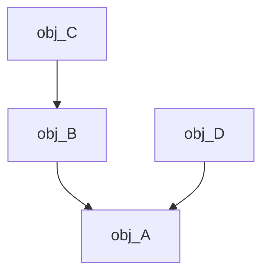

>Полная формулировка вопроса: Приведение типа в С++: static_cast, dynamic_cast, const_cast, reinterpret_cast. Контейнерные классы и итераторы. Требования к контейнерам и итераторам. Категории итераторов. Операции над итераторами. Цикл for для работы с контейнерными объектами.

## Static_cast

>На этапе компиляции выполняется оператор static_cast. Этот оператор используется для приведения родственных классов, находящихся по одной ветви наследования. Также используется для стандартных типов, для которых определён механизм явного приведения.
    
Рассмотрим следующую иерархию:



>С помощью static_cast мы можем от указателя A привестись к указателю B или к указателю на класс C, или от A к D. Он не позволит нам привестись от класса указателя на B к D. Они родственные, но находятся по разным ветвям.
    
```c++
A *pa = new B; // У нас есть указатель 
B *pb = static_cast<B*>(pa); // Приведение
```

>Проблема — это выполняется на этапе компиляции. На этапе компиляции невозможно проверить, что это за объект, то есть приведение будет срабатывать, но указатель pa может не указывать на объект класса B. Мы можем написать такую строчку:

```c++
C *pc = static_cast<C*>(pa); // Приведение
```

B к D можно привести с помощью указателя на void
```c++
void *p = stati_cast<void*>(pb)
D *pd = static_cast<D*>(p)
```
## Const_cast

>Мы работаем с модификатором const. Мы контролируем, что объект может быть константным, контролируем методы. Но есть проблема - мы не можем менять поля константных объектов. Иногда возникают ситуации, когда нам необходимо менять.

>Предположим, у нас есть объект, который держит указатель на другой. Мы определили его, как константный, но этот указатель мы хотим отобрать от него. Чтобы отобрать, нам нужно это поле обнулить. А сделать это мы не можем, так как не можем обнулять поля константных объектов.

>Чтобы убрать модификатор const, используется оператор const_cast. Есть компиляторы, которые не позволяют изменять константность объектов.
## Dynamic_cast
 
>Оператор dynamic_cast делает проверку на этапе выполнения. Он приводит к типу, если реально указатель указывает на объект этого типа. Если нет - возвращает указатель на NULL. Приведение может быть не только указателем, но и ссылкой. Для dynamic_cast есть жесткое требование - базовый класс должен быть полиморфными (то есть либо virtual метод, либо virtual деструктор).

```c++
pb = dynamic_cast<B*>(pa);
if (pb)
```

>Можно проверить: если pb не равно нулю, приведение осуществилось, иначе не осуществилось. В данном случае всё будет нормально, так как pa указывает на объект класса B - приведение возможно. А приведение, например, к указателю на класс С невозможно из pa, так как pa указывает на объект другого класса.

>Такое приведение типов удобно тем, что это удобно на этапе выполнение программ.

>Если работаем со ссылкой в dynamic_cast - вместо NULL возникает исключение bad_cast, которое можно отловить. Исключения ловить неприятно, поэтому лучше работать с указателями.

```c++
dynamic_cast<void*> //будет возвращен указаетль на реальный объект
```

## Reinterpret_cast

> Любую ссылку, любой объект может привести к указателю на что угодно. Не даст привести int к double или double к int.

```c++
class A {...};  
A* p = new A;  
char* pbyte = reinterpret_cast<char*>(p); // Можем выполнить такой бандитизм
```

>Мы поставили указатель типа char на первый байт объекта класса А.

>Это то же самое, как преобразование, которое было в языке Си. Небезопасное преобразование. Неизвестно, к чему это приведет.
## Итераторы

Контейнерные классы и итераторы. Пусть у нас есть класс:
```c++
struct List {
    Node *first, *last;
};
```

Идея: выделить текущий указатель в структуру и создавать по надобности:
```c++
struct Iterator
{
    Node *curent;
};
```

#### Алиасы контейнера: 
```c++

using value_type = T;
using iterator = Iterator<T>;
using const_iterator = ConstIterator<T>
using size_type = size_t 
```

>Стоит задача унификации работы с контейнерными данными. Можно идти по пути унификации интерфейса, чтобы разные контейнерные классы имели один и тот же интерфейс. Желательно, чтобы каждая сущность имела свой интерфейс.

>Идея простая: унифицировать работу с разными контейнерами за счёт итератора. А у итератора будет унифицированный интерфейс.

>Есть базовый шаблон - итератора, и уже конкретный итератор - специализация. 5 видов специализации. Специализация определяется тэгом. Тэг - простейшая структура.
#### Категории итераторов:
- output_iterator_tag; - позволяет только запись в контейнер данных, но не чтение из контейнера.(*, ++)
- input_iterator_tag; - итератор только для чтения, используется с теми контейнерами, которые не гарантируют однозначности при нескольких проходах ответа данных(Есть буфер, каждый проход будет разным)(*, ->, ++, !=, ==)
- forward_iterator_tag - однонаправленный итератор. Однозначность ответа, можно как записывать, так и читать(*, ->, ++, !=, ==)
- bi_directional_iterator_tag - двунаправленный итератор.(*, ->, ++, !=, ==, --)
- random_access_iterator_tag - произвольный доступ. (*, ->, ++, !=, ==, --, ++n, --n, +=, -=, it1 - it2, [])

#### Алиасы для итераторов:
```c++
using pointer = T*
using reference = T&
using difference_type = size_t
```

>Раньше мы вынуждены были любой итератор порождать от этих базовых итераторов. В принципе, в современных стандартах можно свой итератор не порождать от этих стандартных итераторов.

```c++
for (auto elem: obj)  
cout << elem;  
// Цикл выше разворачивается в  
for (Iterator<Type> It = obj.begin(); It != obj.end(); ++It) { 
auto elem = *It;  
cout << elem;  
}
```

>Мы обязаны в контейнерный класс добавить методы: begin, end, cbegin, cend (c - const), rbegin, rend, crbegin, crend. Также добавить операторы: !=, ++, * (++ - префиксный инкремент).

>Контейнер может быть хранитель, но есть проблема. Мы на контейнеры можем создавать итераторы. По этой причине "голенький" указатель в контейнере хранить нельзя. То есть итератор должен хранить weak_ptr. Контейнер должен оборачивать данные в shared_ptr.

>Существуют классы, которые содержат в себе другие классы. Например, множество, вектор и т. п. Такие классы называются контейнерными - они включают в себя другие классы.

>Для работы с контейнерными классами, нам, во-первых, необходимо абстрагироваться от внутренней структуры организации контейнера - нас это не должно интересовать, а во-вторых, мы можем обрабатывать контейнер вне зависимости от типа объекта внутри контейнера. Для этого были придуманы классы-итераторы. Существуют стандартные итераторы, поэтому задача программиста - задавать общий механизм работы с итераторами. Классы, которые отвечают за просмотр содержимого в других объектах, называют итераторами.

>Есть стандартный итератор - шаблон класса Iterator. У него есть специализации под разные виды работы с итераторами. Итераторы делятся на итераторы ввода (мы можем менять то, на что итератор указывает) и итераторы вывода (мы НЕ можем менять то, на что итератор указывает, то есть мы можем только читать, но не записывать).

>Специализация ввода или вывода задаётся при наследовании пользовательского итератора от стандартного итератора.

>Итератор может рассматривать контейнер как направленную последовательность, двунаправленную последовательность и последовательность произвольного доступа.

>С помощью итератора можно просматривать содержимое контейнера.

>Благодаря итераторам в C++ стало возможным создать оператор foreach. Для работы с этим оператором контейнерный класс должен содержать два метода: метод begin(), указывающий на начало последовательности, и метод end(), указывающий на конец последовательности. Конец — это не последний элемент, а ЗА последним элементом.

```c++
for (<тип>& <имя> : <объект>)
{
...
}
```

>При реализации следует предусмотреть итераторы для работы как с константным контейнерным классом, так и с неконстантным.